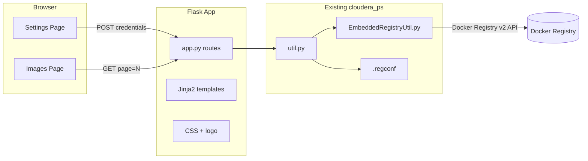

# Embedded Registry Image Manager

## Architecture



## Tech stack

- **Flask** with **Jinja2** server-side rendering (tabs, form, paginated table — no separate JS framework needed)
- Reuse existing helpers in [`cloudera_ps/util.py`](cloudera_ps/util.py):
  - `load_registry_config()` / `save_registry_config()` for `.regconf` (base64-encoded password — not cleartext)
  - `load_registry_image_list()` to call `EmbeddedRegistryUtil`
- Reuse [`cloudera_ps/EmbeddedRegistryUtil.py`](cloudera_ps/EmbeddedRegistryUtil.py) `list_images()` unchanged (returns `[{"image": path, "tags": [...]}, ...]`)

## New files to add

| File | Purpose |
|------|---------|
| [`cloudera_ps/app.py`](cloudera_ps/app.py) | Flask entry point, routes, pagination logic |
| [`cloudera_ps/templates/base.html`](cloudera_ps/templates/base.html) | Banner, tab nav, shared layout |
| [`cloudera_ps/templates/settings.html`](cloudera_ps/templates/settings.html) | Registry URL / user / password form |
| [`cloudera_ps/templates/images.html`](cloudera_ps/templates/images.html) | Paginated image table |
| [`cloudera_ps/static/css/cloudera.css`](cloudera_ps/static/css/cloudera.css) | Cloudera theme |
| [`cloudera_ps/static/img/cloudera-logo.svg`](cloudera_ps/static/img/cloudera-logo.svg) | Logo in banner (sourced from Cloudera media assets) |
| [`requirements.txt`](requirements.txt) | `flask`, `requests` |

## Page 1: Settings (`/settings`)

- Form fields: **Registry URL**, **Username**, **Password**
- On **GET**: load current URL and username from `.regconf`; leave password blank (show placeholder like "unchanged" if config exists)
- On **POST**:
  1. Validate required fields (password optional if config already exists — keep existing encoded password when field is blank)
  2. Call `EmbeddedRegistryUtil(url, user, password)` to verify connectivity/auth before saving (constructor already validates via `GET /v2/`)
  3. On success: `save_registry_config()` writes `.regconf` at project root (hidden dotfile)
  4. On failure: flash error message and re-render form
- `.regconf` format (already implemented in `util.py`):

```json
{
  "registry_url": "https://host:5000",
  "registry_user": "registry-user",
  "registry_password": "<base64-encoded>"
}
```

## Page 2: Images (`/`)

- If no valid `.regconf`: redirect to Settings with a message
- Call `load_registry_image_list()` → `EmbeddedRegistryUtil.list_images()`
- Transform each entry for the table:
  - **Image Path**: `item["image"]`
  - **Tag Count**: `len(item["tags"])`
  - **Latest Tag**: `max(item["tags"])` when tags exist, else `"—"` (alphabetical max; deterministic without extra API calls)
- **Sort**: alphabetically by full image path (`sorted(..., key=lambda x: x["image"])`)
- **Pagination**: 15 images per page via query param `?page=1`; compute `total_pages`, show Prev/Next and page numbers
- Show loading/error states (registry unreachable, auth failure) with user-friendly flash messages
- Optional **Refresh** button to re-fetch from registry (no persistent cache in v1 — keeps implementation simple; note that `list_images()` fetches tags for every repo, so large registries may be slow)

### Suggested additional columns (document in UI help text or footer, not implemented in v1)

These are available from the Docker Registry v2 API but require extra calls beyond `list_images()`:

| Column | Source | Notes |
|--------|--------|-------|
| Manifest digest | `HEAD /v2/{image}/manifests/{tag}` → `Docker-Content-Digest` header | Unique content hash |
| Image size | `GET /v2/{image}/manifests/{tag}` → sum of `layers[].size` | Total stored bytes |
| Architecture / OS | Config blob referenced in manifest | e.g. `amd64`, `linux` |
| Created date | Config blob `created` field | Last build/push timestamp |
| Media type | Manifest `mediaType` | OCI vs Docker schema |
| Layer count | Manifest `layers` array length | Useful for bloat detection |

The `_MANIFEST` constant in `EmbeddedRegistryUtil` is already defined for future extension if you want these later.

## Banner and Cloudera styling

- **App title**: "Embedded Registry Image Manager" in banner
- **Colors** (Cloudera brand):
  - Primary orange: `#F96702`
  - Dark header/nav text: `#1a1a1a` or `#2d2d2d`
  - Light background: `#f5f5f5`
  - White cards/tables with subtle border
- **Banner**: full-width orange or white bar with Cloudera logo (left) + app title (center/left of logo)
- **Typography**: clean sans-serif (system font stack: `-apple-system, Segoe UI, Roboto, sans-serif`)
- **Tabs**: two nav links — "Images" and "Settings" — with active-state orange underline
- **Table**: striped rows, hover highlight, responsive horizontal scroll on narrow screens

## Flask routes summary

```python
GET  /              → images page (paginated)
GET  /settings      → settings form
POST /settings      → validate, save .regconf, redirect or show errors
```

## Running the app

```bash
pip install -r requirements.txt
python -m cloudera_ps.app   # or flask --app cloudera_ps.app run
```

Default: `http://127.0.0.1:5000`

## Error handling

- Missing/incomplete config → redirect to Settings
- `ValueError` from `EmbeddedRegistryUtil` (connection/auth) → flash message on relevant page
- Empty registry → table with "No images found" row
- Per-image tag fetch failures in `list_images()` already degrade to `tags: []` (logged to stdout) — table shows tag count 0

## Testing approach (manual)

1. Open Settings, enter registry URL/user/password, save — confirm `.regconf` created with base64 password (not cleartext)
2. Navigate to Images — verify alphabetical sort, 15-per-page pagination, columns: path / tag count / latest tag
3. Test invalid credentials — error shown, config not saved
4. Test pagination with >15 images
5. Verify banner shows logo and app name with Cloudera orange theme
